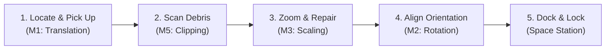

#  Space Salvage Station: Autonomous Spacecraft Recovery System

A real-time 3D interactive space salvage and docking simulation built with **C++** and **OpenGL (GLUT)**. In this simulation, the player pilots a salvage drone to locate, repair, align, and dock five damaged spacecraft components onto a space station docking platform. Once fully assembled, a sleek connecting hull structural chassis links the components, and a launch sequence sends the completed ship into deep space.

This project implements and showcases five syllabus-recognized computer graphics algorithms, each assigned to a specific system/subsystem.

---

## Gameplay & Mission Flow

The game challenges you to complete a 4-level reconstructive rescue operation:



1. **Locate & Pick Up (3D Translation)**: Fly the salvage drone through space using thrusters. Maneuver close to a piece of debris and lock onto it.
2. **Scan Debris (Clipping & Scissoring)**: Enable the Sensor Viewport scanner. Look at structural damage metrics and monitor the alignment indicators.
3. **Zoom & Repair (3D Scaling)**: Trigger the Repair Scanner. The camera zooms deep into the part (scaling up the graphics), revealing damage details. Engage nanite sparks to patch up the component, restoring its color and structure.
4. **Align Orientation (3D Rotation)**: Manually rotate the part using pitch, yaw, and roll keys to match the target docking orientation.
5. **Magnetic Snapping & Docking**: Move close to the correct docking slot. When the part is within **30 degrees** of the correct orientation, **Dynamic Magnetic Snapping** locks it into alignment. Press Enter to dock it securely.
6. **Launch & Integration**: Once all 5 parts are secured, a cohesive fuselage/hull is constructed to link the parts together, the engines ignite, and the spaceship launches.

---

## Core Graphics Algorithms (Subsystem Mapping)

Each subsystem implements a specific syllabus algorithm, with real-time indicators displayed in the HUD.

| Subsystem / Member | Graphics Algorithm | Core Implementation Details |
| :--- | :--- | :--- |
| **Member 1: Drone Navigation** | **3D Translation** | Controls drone movement through 3D space (`glTranslatef`) and handles target part clamping to manipulator arms. |
| **Member 2: Part Alignment** | **3D Rotation** | Corrects component alignment along three axes (`glRotatef`). Features **Dynamic Magnetic Snapping** that locks orientation when close to the target slot. |
| **Member 3: Zoom Repair Scanner** | **3D Scaling** | Scales the graphics context (`glScalef`) to zoom into components by **2.2x**, opening the inspection view to apply repairs. |
| **Member 4: Visibility Engine** | **Z-Buffer** | Implements visible surface detection using `GL_DEPTH_TEST`. Supports runtime debugging to demonstrate rendering without depth sorting. |
| **Member 5: Sensor Viewport** | **Clipping & Scissoring** | Creates a secondary radar sub-viewport using `glViewport`/`glScissor` with dynamic near/far clipping plane configuration. |

---

## Controls & Keybindings

Use the following controls to navigate the game and manage space salvage operations:

### Drone Flight Controls (Member 1: Translation)
*   `W` / `S` : Move Forward / Backward (relative to drone direction)
*   `A` / `D` : Strafe Left / Right
*   `Q` / `E` : Ascend / Descend (Vertical Flight)
*   `J` / `L` : Rotate Drone Yaw (Steering Left / Right)

### Part Rotation Controls (Member 2: Rotation)
*   `Arrow Up` / `Arrow Down` : Rotate Pitch (Carried Part)
*   `Arrow Left` / `Arrow Right` : Rotate Yaw (Carried Part)
*   `U` / `O` : Rotate Roll (Counter-Clockwise / Clockwise)

### Grab, Scan, & Repair Controls (Member 3 & 5)
*   `Spacebar` : Pick Up / Drop adjacent space part
*   `C` : Toggle Sensor Scan Viewport (Toggle PIP Scanner Screen)
*   `R` : Inspect / Repair Carried Part (Press once to zoom/inspect, press again when zoomed to repair)
*   `Enter` : Dock and attach the aligned part to the space station

### Camera & Debug Controls (Member 4 & 5)
*   `V` : Switch Camera View (Third-Person  $\rightarrow$ Top-Down  $\rightarrow$ Cockpit View )
*   `Z` or `F1` : Toggle Z-Buffer Depth Test (Toggle occlusion engine on/off)
*   `[` or `F2` : Decrease Scanner Far Clip Distance (Brings clipping boundary closer)
*   `]` or `F3` : Increase Scanner Far Clip Distance (Pushes clipping boundary away)

---

## Building and Running

### Prerequisites
Make sure you have a C++ compiler (like `g++`) and OpenGL/GLUT libraries installed. On Windows, you can use **MinGW** with **FreeGLUT**.

### Compilation
Open a terminal (PowerShell or Command Prompt) in the project directory and run the following command to compile:

```bash
g++ main.cpp translation.cpp rotation.cpp scaling.cpp zbuffer.cpp clipping.cpp -o SpaceSalvage -lfreeglut -lopengl32 -lglu32
```

### Execution
Run the compiled executable:
```bash
./SpaceSalvage.exe
```

---

## Visual Assets & Design Details

*   **Vibrant Color Palette**: Distinct color coding for states (e.g., Damaged Parts = Red, Cockpit = Blue Dome, Fuel Tank = Glowing Green, Engine = Orange Rings, Cargo = Yellow Box).
*   **Fully Assembled Spaceship**: Features a structural chassis/fuselage connecting all parts, complete with custom panel lines, warning stripes, tail stabilizers, wing pylons, registration text (`SSV-07`), and animated navigation/approach lights.
*   **Volumetric Thruster Jets**: Volumetric thruster flames emit dynamic particles that scale based on movement speed.
*   **Nanite Repair Sparks**: Emits colorful repair particle bursts when a component is successfully repaired.
*   **Cockpit HUD Overlays**: Real-time evaluation indicators monitoring the active status of the five graphics algorithms.
# SpaceSalvageStation
