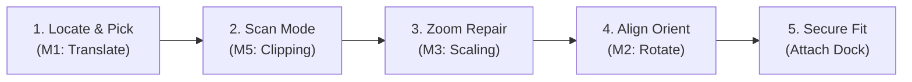

# 🚀 Space Salvage Station — Implementation Plan (Version 2.0)

**Project:** Autonomous Spacecraft Recovery System  
**Tech Stack:** C++ · OpenGL · GLUT · Windows  
**Algorithms Covered:** 3D Translation, 3D Rotation, 3D Scaling, Z-Buffer (Visible Surface Detection), Clipping Algorithm  
**Project-Wide Feature:** Animation (shared — not counted as a member algorithm)

---

## 1. System Mapping & Algorithm Roles

Every member owns **one software subsystem** implementing a syllabus-recognized graphics algorithm. Animation remains a shared project-wide framework.

| Member | Subsystem | Syllabus Algorithm | Key API / Implementation |
|--------|-----------|-------------------|--------------------------|
| **Member 1** | **Drone Navigation System** | 3D Translation | `glTranslatef()` drone flight translation (`W/S/A/D/Q/E`) and clamping target parts to manipulator arms. |
| **Member 2** | **Part Alignment System** | 3D Rotation | `glRotatef()` yaw/pitch rotation (`Arrow Keys`) to correct orbital misalignment prior to docking. |
| **Member 3** | **Zoom Repair Scanner** | 3D Scaling | `glScalef()` auto-zooms part to 2.2x scale upon inspection trigger (`R` key), revealing cracks and executing Nanite repairs. |
| **Member 4** | **Visibility Engine** | Z-Buffer | `glEnable(GL_DEPTH_TEST)` depth sorting. Lecturer debug toggle (`F1`) toggles occlusion engine off to demonstrate Z-buffer bypass. |
| **Member 5** | **Sensor Viewport** | Clipping & Scissoring | `glViewport()`, `glScissor()`, and `gluPerspective(..., near, far)`. Toggles (`C`) a wireframe radar green sub-viewport with adjustable far clip (`F2/F3`). |

---

## 2. Gameplay Mechanics & Cohesive Loops

Instead of a simple test sandbox, the project implements a **reconstructive space rescue flow**:

1. **Locate & Pick (Translation - M1)**: Fly the drone using `WASDQE` through space to target floating debris. Press `Spacebar` to lock manipulator arms onto the target.
2. **Scan Mode (Clipping - M5)**: Press `C` to toggle the Scanner view. The sub-viewport renders a wireframe green matrix displaying structural damage % and rotation alignment error.
3. **Zoom Repair (Scaling - M3)**: Press `R` when carrying a damaged part. The camera automatically scales/zooms the component up, displaying glowing red cracks. Press `R` again to engage Nanite repair sparks. The part transforms color and zooms back out.
4. **Align Orientation (Rotation - M2)**: Rotate the repaired component using `Arrow Keys` (Pitch & Yaw) to match the space station docking configuration.
5. **Secure Fit (Docking)**: Fly close to the correct docking slot and press `Enter` to snap the component into the dock.
6. **Ignition & Lift-Off Sequence**: Once all 5 parts are secured, the reconstructed ship ignites its engines, shakes the viewport, translates upwards, and scales out of sight into deep space.

---

## 3. Visual Specifications

### 3.1 Space Debris Hull Damage Models
- **Cockpit**: Semi-spherical shell with jagged crimson glass cracks drawn as line loops. Once repaired, it heals into a clean glowing blue dome.
- **Thruster Engine**: Damaged nozzle drawn as broken/disconnected metal wireframe fragments. Becomes a solid orange cone on repair.
- **Solar Panels**: Missing solar cells on the right wing segment with dangling wire strands. Re-integrates into a complete panel with cyan grids.
- **Fuel core Canister**: Deformed cylindrical tank with grey intersecting craters representing puncture damage. Heals into a smooth cylinder with green cores.
- **Cargo Container**: Crate lid twisted askew with structural damage lines. Seals securely upon nanite repair.

### 3.2 Immersive Docking Station
- **Control Cabin**: High-tech command deck perched on a vertical pylon with a spinning radar dish cone.
- **Runway Lights**: Sequential green lights flashing along platform boundaries for landing guides.
- **Pulsing Beacon**: Glow lights pulsing on/off at dock rails (`sin(time)` brightness).

### 3.3 Salvage Drone upgrades
- **Headlight Beam**: A volumetric semi-transparent spotlight cone projecting from visors, with a real hardware spotlight source (`GL_LIGHT1`) tracking drone coordinates.
- **Manipulator Arms**: Rotating metal clamps extending forward. They clamp closed when holding parts, and slowly flex when empty.
- **Thruster Plumes**: Volumetric engine exhaust flames that expand/contract dynamically based on keyboard speed inputs.

---

## 4. Live Algorithm Status Monitor

An orthographic HUD overlay tracks algorithm utilization for the lecturer:
- Displays a checklist of the 5 systems (M1 to M5).
- Highlights systems as `[RUNNING]` when active (e.g., M1 active on flight, M2 on rotation, M3 on zoom repair, M5 on scanner).
- Provides a **Lecturer debug panel** mapping Z-Buffer override and far clipping plane parameters to `F1`, `F2`, and `F3` keys.

---

## 5. Timeline & Milestones

All implementation steps are completed, compiled successfully, and verified warning-free under Windows using FreeGLUT.
